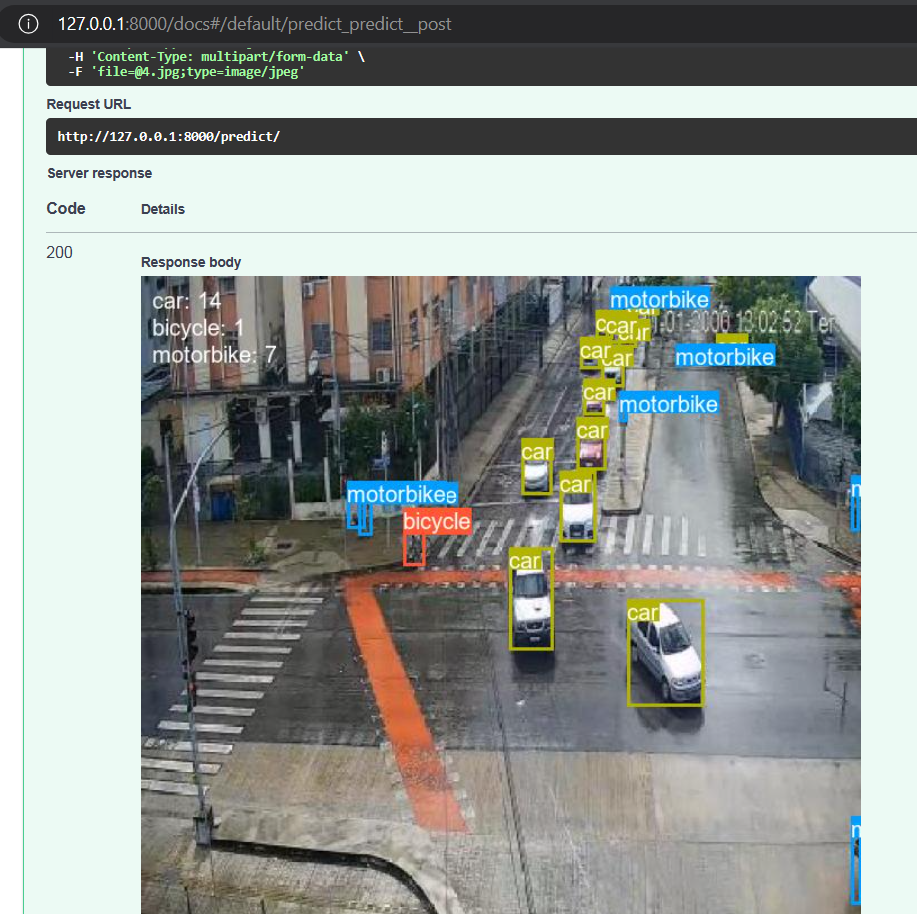
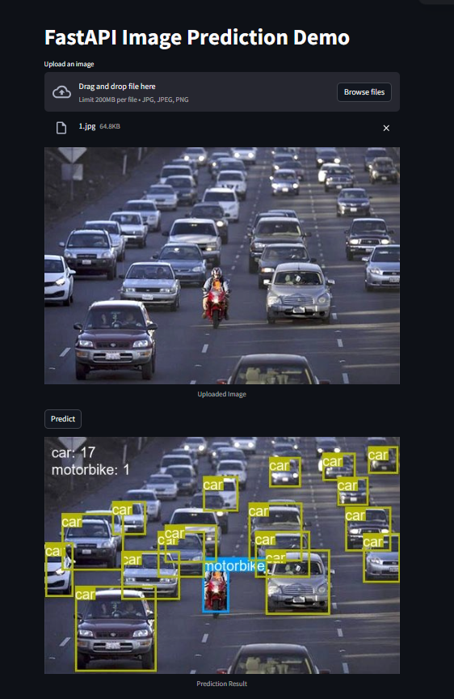
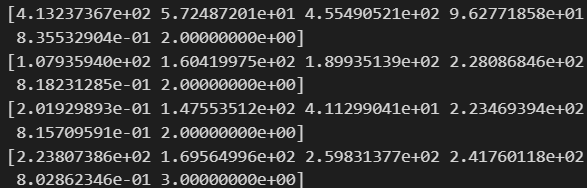
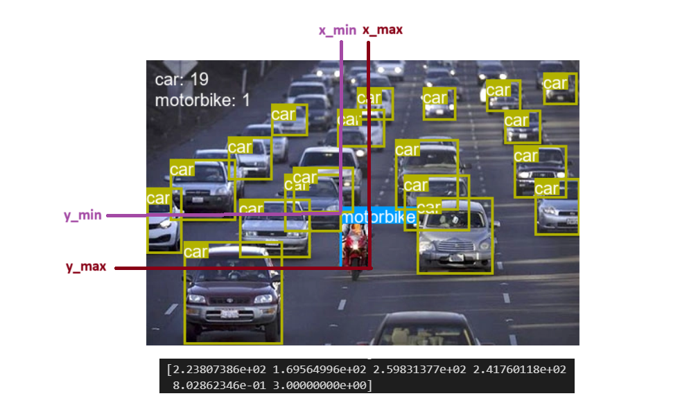

# YOLOv5 Medium Model Trained on 5 Classes

This repository contains a YOLOv5 model trained on a dataset that includes 5 classes: Person, Bus, Car, Motorbike, and Bicycle. YOLO (You Only Look Once) is a popular object detection model capable of real-time object detection. The "Medium" variant of YOLOv5 refers to the specific architecture and model size used in this implementation.

## Model Details

- **Model Size**: Medium
- **Classes**: 5 (Person, Bus, Car, Motorbike, Bicycle)
- **Framework**: PyTorch
- **Input Image Size**: 448x448
- **Hyperparameters**: lr0=0.01, lrf=0.01, momentum=0.937, weight_decay=0.0005, warmup_epochs=3.0, warmup_momentum=0.8, warmup_bias_lr=0.1, box=0.05, cls=0.5, cls_pw=1.0, obj=1.0, obj_pw=1.0, iou_t=0.2, anchor_t=4.0, fl_gamma=0.0, hsv_h=0.015, hsv_s=0.7, hsv_v=0.4, degrees=0.0, translate=0.1, scale=0.5, shear=0.0, perspective=0.0, flipud=0.0, fliplr=0.5, mosaic=1.0, mixup=0.0, copy_paste=0.0

## Installation and Dependencies


## Usage

To use this YOLOv5 model for transportation detection, follow these steps:

1. Clone this repository:

```bash
git clone https://github.com/hotonbao/YOLOV5.git
cd YOLOV5
```

2. Dowload Weight File:
   
   Weight: https://drive.google.com/file/d/1zw0rR7iSfobJ9CwPXe2-YqvjrSmjzt_T/view?usp=sharing

   **Notice:** *Replace PATH_MODEL in the configs.py file with the pre-trained model file.*
  

3. Run the inference script to perform object detection on an image with FastAPI or Streamlit:

   **FastAPI**:
   ```bash
   uvicorn api:api --port 8000
   ```
   Type "/docs" after link  http://127.0.0.1:8000 to test with any image
   

   **Streamlit**:
   
   Notice: Run FastAPI before run Streamlit and open new command line and run:
   ```bash
   streamlit run app.py --server.fileWatcherType=none
   ```
   It will open:
   


4. Ouput:
   Run test.ipynb file to see output.

   Example:
   
   *It is an object that has 6 arguments equivalent to* 
   **[ xmin, ymin, xmax, ymax, confidence, classname ']**

   Description:
   
   Confidence score: Prediction score of class.

   *Class name: has been encoded :*
   0: "bicycle",
   1: "bus",
   2: "car",
   3: "motorbike",
   4: "person"
## Model Performance

- Loss 
 
- F1 Score For Class :
- 

## Training

**Dataset:**
   https://www.kaggle.com/datasets/yusufberksardoan/traffic-detection-project/

Load the dataset link in and enter yolov5-training.ipynb run all cells then download the best m.onnx file.

## Acknowledgments

https://github.com/ultralytics/yolov5/tree/master/models

Visit the link if you want to train the model with many different architectural sizes

## License

[Specify the license for your repository if applicable. For example, use MIT, Apache, or your preferred license.]

## Author

Ho Ton Bao 

## Contact

Phone number : +84949800149

Email: htbqn2003@gmail.com


---
